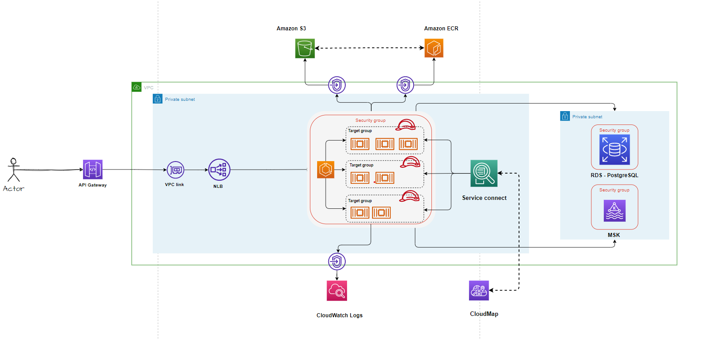

# Deploy Dataflow in ECS Fargate behind API Gateway & NLB for Secure Optimal Accessibility
## Overview
This repository contains the source code for a containerised application in AWS ECS Fargate inside a VPC's private subnets. An API Gateway is used as the doorway to the private network using a VPC link to access the VPC. An NLB is for optimal performance of accessing the application running in the private subnets.


## Technical Architecture Diagram


<!-- BEGIN_TF_DOCS -->
## Requirements

| Name | Version |
|------|---------|
| <a name="requirement_aws"></a> [aws](#requirement\_aws) | ~>3.0 |
| <a name="requirement_aws"></a> [Terraform](#requirement\_aws) | v1.4.5 |


## Providers

| Name | Version |
|------|---------|
| <a name="provider_aws"></a> [aws](#provider\_aws) | 4.59.0 |

## Modules

| Name | Source | Version |
|------|--------|---------|
| vpc_for_ecs_fargate | ./vpc-cluster | n/a |
| ecs_cluster | ./ecs-cluster | n/a |
| msk_cluster | ./msk-cluster | n/a |   
| rds_postgresql | ./rds-postgres | n/a | 
| api_gateway | ./api-gateway | n/a | 
| fargate_cluster | ./fargate-cluster | n/a | 


## Resources

| Name | Type |
|------|------|
|<a href="vpc">Amazon Virtual Private Cloud</a> | resource |
|<a href="ecs">Amazon Elastic Container Service (Amazon ECS)</a> | resource |
|<a href="elb">Network Load Balancer</a> | resource |
|<a href="msk">Amazon Managed Streaming for Apache Kafka(Amazon MSK)</a> | resource |
|<a href="rds">Amazon Managed Relational Database - Amazon RDS</a> | resource |
|<a href="api-gateway">Amazon API Gateway</a> | resource |
|<a href="cloudmap"> AWS Cloud Map</a> | resource |
|<a href="cloudwatch"> Amazon CloudWatch</a> | resource |
|<a href="s3">  Amazon Simple Storage Service (Amazon S3) </a> | resource |
|<a href="ecr">  Amazon Elastic Container Registry </a> | resource |


## vpc_for_ecs_fargate module Inputs 

| Name | Description | Type | Default | Required |
|------|-------------|------|---------|:--------:|
| <a href="environment">environment</a>| Value of the Environment (dev, uat, prod, ...) | `string` | n/a | yes |
| <a href="vpc_cidr_block">vpc_cidr_block</a> | Vpc cidr block | `string` | n/a | yes |
| <a href="number_of_private_subnets">number_of_private_subnets</a>| Number of private subnets | `number` | n/a | yes |
| <a href="private_subnet_tag_name">private_subnet_tag_name</a> | Private subnet tag name | `string` | n/a | yes |
| <a href="private_subnet_cidr_blocks">private_subnet_cidr_blocks</a>| Private subnet cidr blocks | `string` | n/a | yes |
| <a href="availability_zones">availability_zones</a> | Availability zones | `string` | n/a | yes |   
| <a href="region">region</a> | AWS region | `string` | n/a | yes |  
| <a href="vpc_tag_name">vpc_tag_name</a> | Vpc tag name  | `string` | n/a | yes |


## vpc_for_ecs_fargate module Outputs

| Name | Description |
|------|-------------|
| <a href="output vpc_id">output vpc_id</a> | The ID of vpc |
| <a href="output vpc_arn">output vpc_arn</a> | The  vpc arn |
| <a href="output private_subnet_ids">output private_subnet_ids</a> | The private subnet idsc |


## ecs_cluster module Inputs 

| Name | Description | Type | Default | Required |
|------|-------------|------|---------|:--------:|
| <a href="name">name</a>| The name of the cluster | `string` | n/a | yes |
| <a href="cluster_tag_name">cluster_tag_name</a> |Cluster tag name | `string` | n/a | yes |
| <a href="namespace">number_of_private_subnets</a>|The namespace related with ecs cluster | `string` | n/a | yes |

## ecs_cluster module Outputs

| Name | Description |
|------|-------------|
| <a href="output id">output id</a> | The ID of ecs cluster |
| <a href="output arn">output arn</a> | The  ecs cluster arn |
| <a href="output namespace">output namespace</a> | cloudMmap namespace used in ecs service connect |


## msk_cluster module Inputs 

| Name | Description | Type | Default | Required |
|------|-------------|------|---------|:--------:|
| <a href="cluster_name">cluster_name</a>| The name of the msk cluster | `string` | n/a | yes |
| <a href="private_subnet_ids">private_subnet_ids</a> | Private subnet ids when the MSK cluster provisioned | `string` | n/a | yes |
| <a href="vpc_id">vpc_id</a>|The network when the MSK cluster provisioned | `string` | n/a | yes |


## msk_cluster module Outputs

| Name | Description |
|------|-------------|
| <a href="output bootstrap_brokers">output bootstrap_brokers</a> | PLAINTEXT connection host:port pairs |


## fargate_cluster module Inputs 

| Name | Description | Type | Default | Required |
|------|-------------|------|---------|:--------:|
| <a href="environment">environment</a>|Value of the Environment (dev, uat, prod, ...)| `string` | n/a | yes |
| <a href="family_name">family_name</a>| The name of the task definition family | `string` | n/a | yes |
| <a href="env_file">env_file</a> | The location of the container environment variables file | `string` | n/a | yes |
| <a href="dns_name">dns_name</a>|Service connect dns name | `string` | n/a | yes |
| <a href="container_name">container_name</a>|The name of the container | `string` | n/a | yes |
| <a href="app_image">app_image</a>| The name of docker image used that we store on ECR | `string` | n/a | yes |
| <a href="namespace">namespace</a>|Service connect namespace in cloudMap | `string` | n/a | yes |
| <a href="port_mapping">port_mapping</a>| The name of port mapping created in task def before | `string` | n/a | yes |
| <a href="fargate_cpu">fargate_cpu</a>|the number of vcpu will use by the task | `number` | n/a | yes |
| <a href="fargate_memory">fargate_memory</a>| The amount of memory  will use by the task  | `number` | n/a | yes |
| <a href="app_port">app_port</a>|The container port  | `number` | n/a | yes |
| <a href="vpc_id">vpc_id</a>|The vpc id  | `string` | n/a | yes |
| <a href="logs">logs</a>|The cloudwatch log group  | `string` | n/a | yes |
| <a href="tg_name">tg_name</a>|The target group name  | `string` | n/a | yes |
| <a href="service_connect_port">service_connect_port</a>|Service connect port that will use to inter-connect micro-services  | `number` | n/a | yes |
| <a href="cluster_id">cluster_id</a>|Ecs cluster id  | `string` | n/a | yes |
| <a href="app_count">app_count</a>|The number of desired tasks   | `number` | n/a | yes |
| <a href="security_group_ecs_tasks_name">security_group_ecs_tasks_name</a>| Task security group  | `string` | n/a | yes |
| <a href="private_subnet_ids">private_subnet_ids</a>|Private subnet ids when tasks deployed  | `string` | n/a | yes |


## fargate_cluster module Outputs

| Name | Description |
|------|-------------|
| <a href="output nlb_dns_name">output nlb_dns_name</a> | DNS name for the internal NLB |
| <a href="output nlb_arn">output nlb_arn</a> | ARN for the internal NLB |


## api_gateway module Inputs 

| Name | Description | Type | Default | Required |
|------|-------------|------|---------|:--------:|
| <a href="environment">environment</a>|Value of the Environment (dev, uat, prod, ...)| `string` | n/a | yes |
| <a href="name">name</a>| The name of the api gateway | `string` | n/a | yes |
| <a href="integration_input_type">integration_input_type</a> | The integration type(HTTP_PROXY)  | `string` | n/a | yes |
| <a href="path_part">path_part</a>|The path part({proxy+}) | `string` | n/a | yes |
| <a href="nlb_dns_name">nlb_dns_name</a>| The network load balancer dns  | `string` | n/a | yes |
| <a href="nlb_arn">nlb_arn</a> | The network load balancer arn  | `string` | n/a | yes |


## rds_postgresql module Inputs 

| Name | Description | Type | Default | Required |
|------|-------------|------|---------|:--------:|
| <a href="vpc_id">vpc_id</a>|The vpc id  | `string` | n/a | yes |
| <a href="subnet_ids">subnet_ids</a>| subnet ids when RDS postgres database deployed  | `string` | n/a | yes |
| <a href="parameter_group_name">parameter_group_name</a>| The name of the parametre group | `string` | n/a | yes |
| <a href="parameter_group_family">parameter_group_family</a> | The parametre group family  | `string` | n/a | yes |
| <a href="param_log_statement">param_log_statement</a>| The parametre log statement | `string` | n/a | yes |
| <a href="max_allocated_storage">max_allocated_storage</a> | The max allocated storage for database serve  | `number` | n/a | yes |
| <a href="allocated_storage">allocated_storage</a>|The allocated storage for database server | `number` | n/a | yes |
| <a href="storage_type">storage_type</a>| The storage type | `string` | n/a | yes |
| <a href="instance_class">instance_class</a> | The instance class | `string` | n/a | yes |
| <a href="db_username">db_username</a>| The db username | `string` | n/a | yes |
| <a href="db_password">db_password</a> | The db password | `string` | n/a | yes |
| <a href="db_port">db_port</a>| The db port | `number` | n/a | yes |
| <a href="instance_class">instance_class</a> | The instance class(db.t3.medium) | `string` | n/a | yes |
| <a href="multi_az">multi_az</a> | multi_az or not | `bool` | n/a | yes |
| <a href="skip_final_snapshot">skip_final_snapshot</a>| skip final snapshot or not | `bool` | n/a | yes |
| <a href="backup_retention_period">backup_retention_period</a> | The backup retention period | `number` | n/a | yes |
| <a href="enabled_cloudwatch_logs_exports">enabled_cloudwatch_logs_exports</a>| enabled cloudwatch logs exports or not | `bool` | n/a | yes 


# steps to deploy dataflow infrastructure
## create s3 bucket as a remote backend for our terraform state
  ```
terraform {
  required_version = ">=0.12"
  backend "s3" {
    bucket = "your-backet-name"
    key    = "your key name in the backet level"
    region = "your-region"
  }
}
  ```
## Push Docker Image to ECR
The main thing we want to achieve on this part is to push a dataflow, skipper, app stream... docker images to an AWS ECR repository
  1. Authenticate to AWS ECR,
  ```
  aws ecr get-login --no-include-email
  ```
  2. create repository
  ```
  aws ecr create-repository --repository-name my-repo
  ```
  4. push docker image to ECR
  ```
  docker push <your-aws-account-number>.dkr.ecr.<aws-region>.amazonaws.commy-repo:latest
  ```
  
  
## Setting up our VPC Network Infrastructure
Amazon VPC lets us provision a logically isolated section of the Amazon Web Services Cloud where we can launch our resources in a virtual network that we define
### Custom VPC & Private Subnets
 ```
  resource "aws_vpc" "custom_vpc" {
    cidr_block       = var.vpc_cidr_block
    enable_dns_support = true
    enable_dns_hostnames = true

    tags = {
      Name = "${var.vpc_tag_name}-${var.environment}"
    }
  }


  # Create the private subnets
  resource "aws_subnet" "private_subnet" {
    count = var.number_of_private_subnets
    vpc_id            = "${aws_vpc.custom_vpc.id}"
    cidr_block = "${element(var.private_subnet_cidr_blocks, count.index)}"
    availability_zone = "${element(var.availability_zones, count.index)}"

    tags = {
      Name = "${var.private_subnet_tag_name}-${count.index}-${var.environment}"
    }
  }
   ```
### Security Groups
Create a security group that we’ll attach to our instances for our ECS tasks as well as our VPC endpoint interface components. 
These are the rules we want to apply to our security group:
  1. Allow inbound traffic on the application port for the VPC CIDR range because our NLB will be forwarding incoming traffic to the instances.
   ```
  resource "aws_security_group" "ecs_tasks" {
    name        = "${var.security_group_ecs_tasks_name}-${var.environment}"
    description = var.security_group_ecs_tasks_description
    vpc_id      = "${var.vpc_id}"

    ingress {
      protocol    = "tcp"
      from_port   = var.app_port
      to_port     = var.app_port
      cidr_blocks = ["11.0.0.0/16"]
    }

    ingress {
      protocol    = "-1"
      from_port   = 0
      to_port     = 0
      cidr_blocks = ["0.0.0.0/0"]
    }


    egress {
      protocol    = "-1"
      from_port   = 0
      to_port     = 0
      cidr_blocks = ["0.0.0.0/0"]
    }
  }
   ```
  2. Allow communication between the VPC endpoint network interfaces and the resources in our VPC that communicate with those services.
  ```
    resource "aws_security_group" "privatelink_sg" {
      lifecycle {
      ignore_changes = [name]
    }
    name        = "privatelinks-sg"
    description = "allow between subnet and ecr s3 cloudwatch"
    vpc_id      = "${aws_vpc.custom_vpc.id}"

    ingress {
      protocol        = "tcp"
      from_port       = 443
      to_port         = 443
      cidr_blocks = [var.vpc_cidr_block]
    }

    egress {
      from_port       = 443
      to_port         = 443
      protocol        = "tcp"
      prefix_list_ids = [
        aws_vpc_endpoint.s3.prefix_list_id
      ]
    }

    egress {
      from_port       = 443
      to_port         = 443
      protocol        = "tcp"
      cidr_blocks = [var.vpc_cidr_block]
    }

    egress {
      protocol    = "-1"
      from_port   = 0
      to_port     = 0
      cidr_blocks = ["0.0.0.0/0"]
    }
  }
   ```
   
### PrivateLink VPC Endpoints
Our private subnets have no access to the Internet, but we need our fargate Tasks that will be running our containers to communicate with the ECR repository to pull our Docker image, as well as communicate with the ECS control plane. Before AWS PrivateLink, fargate Tasks had to use an internet gateway to download Docker images stored in ECR or communicate to the ECS control plane. This meant we had to attach an Internet Gateway to our VPC, as well as deploy a NAT Gateway in our public subnet for our private subnets to have access to the Internet.

Instead, we are going to use PrivateLink VPC Endpoints. This enables enhanced security by allowing us to deny our private  fargate Tasks access to anything other than the AWS services we need access to. When you create AWS PrivateLink endpoints for ECR and ECS, these service endpoints appear as Elastic Network Interfaces (ENIs) with a private IP address in your VPC. We’re going to be setting up VPC endpoints for the following services:

1. AWS PrivateLink endpoints for ECR — This allows instances in your VPC to communicate with ECR to download image manifests  
  ```
  resource "aws_vpc_endpoint" "ecr_dkr" {
  vpc_id       = "${aws_vpc.custom_vpc.id}"
  service_name = "com.amazonaws.${var.region}.ecr.dkr"
  vpc_endpoint_type = "Interface"
  private_dns_enabled = true
  subnet_ids          = aws_subnet.private_subnet.*.id

  security_group_ids = [
    aws_security_group.privatelink_sg.id,
  ]

  tags = {
    Name = "ECR Docker VPC Endpoint Interface - ${var.environment}"
    Environment = var.environment
  }
  }
  resource "aws_vpc_endpoint" "ecr_api" {
  vpc_id       = "${aws_vpc.custom_vpc.id}"
  service_name = "com.amazonaws.${var.region}.ecr.api"
  vpc_endpoint_type = "Interface"
  private_dns_enabled = true
  subnet_ids          = aws_subnet.private_subnet.*.id

  security_group_ids = [
    aws_security_group.privatelink_sg.id,
  ]

  tags = {
    Name = "ECR API VPC Endpoint Interface - ${var.environment}"
    Environment = var.environment
  }
}
  ```
2. CloudWatch — This will allow our instances to send application logs to CloudWatch.

  ```
  resource "aws_vpc_endpoint" "cloudwatch" {
  vpc_id       = "${aws_vpc.custom_vpc.id}"
  service_name = "com.amazonaws.${var.region}.logs"
  vpc_endpoint_type = "Interface"
  subnet_ids          = aws_subnet.private_subnet.*.id
  private_dns_enabled = true

  security_group_ids = [
    aws_security_group.privatelink_sg.id,
  ]

  tags = {
    Name = "CloudWatch VPC Endpoint Interface - ${var.environment}"
    Environment = var.environment
  }
}
  ```
  
3. Gateway VPC endpoint for Amazon S3 — This allows instances to download the image layers from the underlying private Amazon S3 buckets that host them.

  ```
  resource "aws_vpc_endpoint" "s3" {
  vpc_id       = "${aws_vpc.custom_vpc.id}"
  service_name = "com.amazonaws.${var.region}.s3"
  vpc_endpoint_type = "Gateway"
  route_table_ids = [aws_vpc.custom_vpc.default_route_table_id]

  tags = {
    Name = "S3 VPC Endpoint Gateway - ${var.environment}"
    Environment = var.environment
  }
}
  ```
  
## setting up Elastic Container Service (ECS) cluster
Amazon ECS is a lower level resource for dealing with Docker container management.
### Let’s create a ECS cluster:
 ```
 resource "aws_ecs_cluster" "main" {
  name = var.name

  tags = {
    Name = var.cluster_tag_name
  }
}
```
###  a task definition :
```
resource "aws_ecs_task_definition" "main" {
  family             = var.family_name
  task_role_arn = aws_iam_role.task_role.arn
  execution_role_arn = aws_iam_role.main_ecs_tasks.arn
  network_mode       = "awsvpc"
  requires_compatibilities = ["FARGATE"]
  cpu    = var.fargate_cpu
  memory = var.fargate_memory
  container_definitions = jsonencode([
    {
      name : var.container_name,
      image : var.app_image,
      cpu : var.fargate_cpu,
      memory : var.fargate_memory,
      networkMode : "awsvpc",
      portMappings : [
        {
          name: var.port_mapping,
          containerPort : var.app_port
          protocol : "tcp",
          hostPort : var.app_port,
          appProtocol: "http"
        }
      ],
            "essential": true,
            "environment": jsondecode(file("${var.env_file}")),
      "logConfiguration": {
                "logDriver": "awslogs",
                "options": {
                    "awslogs-create-group": "true",
                    "awslogs-group": var.logs,
                    "awslogs-region": "us-east-1",
                    "awslogs-stream-prefix": "ecs"
                }
            }
    }
  ])
}
```

###  a service to create instances of the task definition :
```
resource "aws_ecs_service" "main" {
  name            = "${var.family_name}-service"
  cluster         = var.cluster_id
  task_definition = aws_ecs_task_definition.main.family
  desired_count   = var.app_count
  launch_type     = "FARGATE"

  network_configuration {
    security_groups = ["${aws_security_group.ecs_tasks.id}"]
    subnets         = var.private_subnet_ids
  }

  load_balancer {
    target_group_arn = aws_lb_target_group.tg.arn
    container_name   = var.family_name
    container_port   = var.app_port
  }

  service_connect_configuration {
    enabled = true
    namespace = var.namespace
    service {
       port_name =  var.port_mapping
      client_alias {
        port     = var.service_connect_port
        dns_name = var.dns_name
      }
    }
  }

  depends_on = [
    aws_ecs_task_definition.main,
  ]
}
```

## setting up Network Load Balancer
We’re going to be running our service behind a Network Load Balancer associated with the private subnets and will distribute traffic across the tasks that are associated with the service. Network Load Balancers operate at the connection level (Layer 4) and are capable of handling millions of requests per second, while maintaining ultra-low latency. If you’re looking for extreme performance as opposed to intelligent routing (ALB) this is the load balancer to use. It is important to note that you cannot associate security groups with Network Load Balancers, but you can if you’re using Application Load Balancers.

You’ll notice that in this section we’ll also setup a target group for our NLB which we associate with the ECS Service.

```
resource "aws_lb" "nlb" {
  name               = "nlb"
  internal           = true
  load_balancer_type = "network"
  subnets            = var.private_subnet_ids

  enable_deletion_protection = false

  tags = {
    Environment = var.environment
  }
}

Target group for alb
resource "aws_lb_target_group" "tg" {
  depends_on  = [
    aws_lb.nlb
  ]
  name        = var.tg_name
  port        = var.app_port
  protocol    = "TCP"
  target_type = "ip"
  vpc_id      = var.vpc_id
}


Redirect all traffic from the NLB to the application load balancer as a target group
resource "aws_lb_listener" "nlb_listener" {
  load_balancer_arn = aws_lb.nlb.arn
  port              = var.app_port
  protocol    = "TCP"

  default_action {
    target_group_arn = aws_lb_target_group.tg.arn
    type             = "forward"
  }
}
```


## Creating an API Gateway & VPC Link
we’ll be creating a RESTful API that will proxy incoming requests to our private VPC resources. To accomplish this we’ll have to create a private integration with a VPC Link to encapsulate connections between API Gateway and the targeted VPC resource, which is our Network Load Balancer.
### Example skipper server
```
resource "aws_api_gateway_vpc_link" "this" {
  name = "vpc-link-${var.name}"
  target_arns = [var.nlb_arn]
}

resource "aws_api_gateway_rest_api" "main" {
  name = "api-gateway-${var.name}"
}


resource "aws_api_gateway_resource" "main" {
  rest_api_id = "${aws_api_gateway_rest_api.main.id}"
  parent_id   = "${aws_api_gateway_rest_api.main.root_resource_id}"
  path_part   = "skipper"
}

resource "aws_api_gateway_resource" "proxy" {
  rest_api_id = "${aws_api_gateway_rest_api.main.id}"
  parent_id   = "${aws_api_gateway_resource.main.id}"
  path_part   = var.path_part
}

resource "aws_api_gateway_method" "main" {
  rest_api_id   = "${aws_api_gateway_rest_api.main.id}"
  resource_id   = "${aws_api_gateway_resource.proxy.id}"
  http_method   = "ANY"
  authorization = "NONE"

  request_parameters = {
    "method.request.path.proxy" = true
  }
}
resource "aws_api_gateway_integration" "main" {
  rest_api_id = "${aws_api_gateway_rest_api.main.id}"
  resource_id = "${aws_api_gateway_resource.proxy.id}"
  http_method = "${aws_api_gateway_method.main.http_method}"

  request_parameters = {
    "integration.request.path.proxy" = "method.request.path.proxy"
  }

  type                    = var.integration_input_type
  uri                     = "http://${var.nlb_dns_name}:7577/{proxy}"
  integration_http_method = var.integration_http_method

  connection_type = "VPC_LINK"
  connection_id   = "${aws_api_gateway_vpc_link.this.id}"
}
```


<!-- END_TF_DOCS -->

